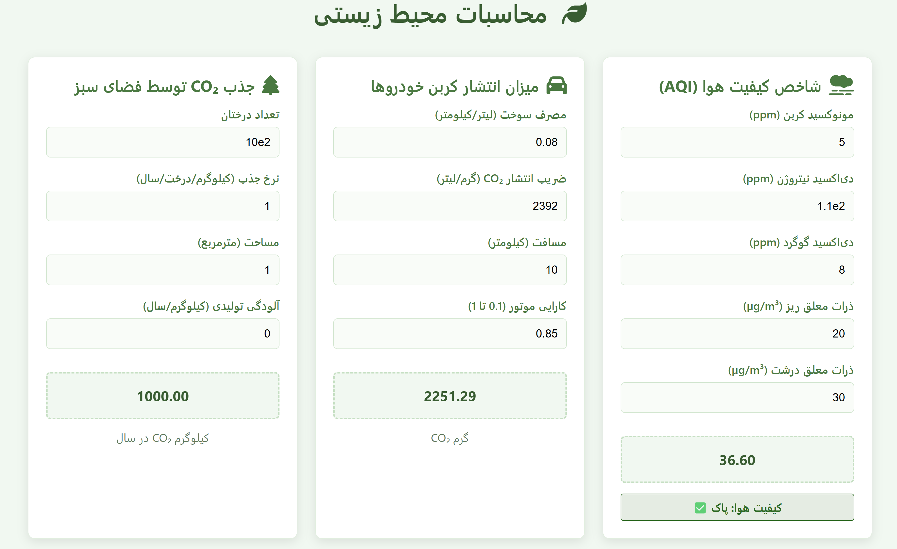

# محاسبات محیط زیستی

## معرفی

این تمرین یک وب‌سایت محاسبات محیط زیستی است که شامل سه بخش اصلی است:

1. **شاخص کیفیت هوا (AQI)**: بر اساس ورودی‌های مربوط به آلاینده‌های مختلف، مقدار AQI محاسبه می‌شود.
2. **میزان انتشار کربن خودروها**: محاسبه میزان CO₂ منتشر شده توسط خودرو بر اساس مصرف سوخت، ضریب انتشار و مسافت طی شده.
3. **جذب CO₂ توسط فضای سبز**: محاسبه میزان CO₂ جذب شده توسط درختان با در نظر گرفتن تعداد درختان و مساحت تحت پوشش.

## فرمول‌های ریاضی

### 1. شاخص کیفیت هوا (AQI)

$$
AQI = (CO \times 0.3) + (NO_2 \times 0.25) + (SO_2 \times 0.2) + (PM_{2.5} \times 0.15) + (PM_{10} \times 0.1)
$$

که به صورت زیر پیاده سازی شده است:
```html
<formula evaluator="(CO*0.3)+(NO2*0.25)+(SO2*0.2)+(PM2_5*0.15)+(PM10*0.1)"></formula>
<div class="aqi-description"></div>
```

### 2. میزان انتشار کربن خودروها

$$
CO₂ = \frac{fuelConsumption \times emissionFactor \times distance}{efficiency}
$$

که به صورت زیر پیاده سازی شده است:
```html
<formula evaluator="(fuelConsumption*emissionFactor*distance)/efficiency"></formula>
<div class="unit">گرم CO₂</div>
```
### 3. جذب CO₂ توسط فضای سبز

$$
CO₂_{absorbed} = (treeCount \times absorptionRate \times areaCovered) - pollutionGenerated
$$


که به صورت زیر پیاده سازی شده است:
```html
<formula evaluator="(treeCount*absorptionRate*areaCovered)-pollutionGenerated"></formula>
<div class="unit">کیلوگرم CO₂ در سال</div>
```
## ورودی‌ها

### 1. ورودی‌های مربوط به AQI

```html
<label for="CO">مونوکسید کربن (ppm)</label>
<input type="number" id="CO" value="5">
            
<label for="NO2">دی‌اکسید نیتروژن (ppm)</label>
<input type="number" id="NO2" value="10">
            
<label for="SO2">دی‌اکسید گوگرد (ppm)</label>
<input type="number" id="SO2" value="8">
            
<label for="PM2_5">ذرات معلق ریز (µg/m³)</label>
<input type="number" id="PM2_5" value="20">
            
<label for="PM10">ذرات معلق درشت (µg/m³)</label>
<input type="number" id="PM10" value="30">
```


### 2. ورودی‌های میزان انتشار کربن خودروها

```html
<label for="fuelConsumption">مصرف سوخت (لیتر/کیلومتر)</label>
<input type="number" id="fuelConsumption" value="0.08" step="0.01">
            
<label for="emissionFactor">ضریب انتشار CO₂ (گرم/لیتر)</label>
<input type="number" id="emissionFactor" value="2392">
            
<label for="distance">مسافت (کیلومتر)</label>
<input type="number" id="distance" value="100">
            
<label for="efficiency">کارایی موتور (0.1 تا 1)</label>
<input type="number" id="efficiency" value="0.85" step="0.01" min="0.1" max="1">
```

### 3. ورودی‌های جذب CO₂ توسط فضای سبز

```html
<label for="treeCount">تعداد درختان</label>
<input type="number" id="treeCount" value="10">
            
<label for="absorptionRate">نرخ جذب (کیلوگرم/درخت/سال)</label>
<input type="number" id="absorptionRate" value="10">
            
<label for="areaCovered">مساحت (مترمربع)</label>
<input type="number" id="areaCovered" value="10">
            
<label for="pollutionGenerated">آلودگی تولیدی (کیلوگرم/سال)</label>
<input type="number" id="pollutionGenerated" value="500">
```

## بررسی کد JavaScrip

### 1. تابع initialize

```js
initialize() {
...
}
```
تابع `initialize()` تمامی فیلدهای ورودی را پیدا کرده و جهت آن‌ها را چپ به راست و متن را از چپ تراز می‌کند. سپس برای هر فرمول در صفحه، یک `<div>` با کلاس `result` و مقدار اولیه `0` اضافه می‌کند تا نتیجه محاسبات در آن نمایش داده شود. در ادامه، برای هر ورودی یک رویداد `input` تنظیم می‌کند که هنگام تغییر مقدار، تابع `validateInput()` را اجرا کرده، همه فرمول‌ها را دوباره محاسبه کرده و توضیحات مربوطه را به‌روز می‌کند. در نهایت، هنگام مقداردهی اولیه، تمامی فرمول‌ها محاسبه و توضیحات آن‌ها بروزرسانی می‌شود.

### 2. تابع validateInput

```js
validateInput(input) {
    input.value = input.value.replace(/[^0-9.]/g, '');
            
    if ((input.value.match(/\./g) || []).length > 1) {
        input.value = input.value.substring(0, input.value.lastIndexOf('.'));
    }
            
    input.style.direction = 'ltr';
    input.style.textAlign = 'left';
}
```
تابع `validateInput(input)` مقدار ورودی را بررسی کرده و تمامی کاراکترهای غیرعددی و غیر از نقطه را حذف می‌کند. اگر بیش از یک نقطه اعشار در مقدار ورودی وجود داشته باشد، مقدار اضافی را حذف می‌کند و فقط آخرین نقطه اعشار را نگه می‌دارد. در نهایت، جهت متن ورودی را چپ به راست و تراز آن را از چپ تنظیم می‌کند.

### 3. تابع evaluateAllFormulas

```js
evaluateAllFormulas() {
    this.formulaElements.forEach(formula => {
        this.evaluateFormula(formula);
    });
}
```
تابع `evaluateAllFormulas()` روی تمام عناصر فرمول در صفحه پیمایش کرده و برای هر یک از آن‌ها تابع `evaluateFormula(formula)` را فراخوانی می‌کند تا مقدار آن محاسبه و به‌روز شود.

### 4. تابع evaluateFormula

```js
evaluateFormula(formulaElement) {
.
.
.
}
```
تابع `evaluateFormula(formulaElement)` ابتدا مقدار فرمول را از ویژگی `evaluator` عنصر دریافت می‌کند و متغیرهای موجود در آن را شناسایی می‌کند. سپس برای هر متغیر، مقدار ورودی کاربر را از عناصر مربوطه دریافت کرده و بررسی می‌کند که مقدار خالی یا غیرمجاز (مثل مقادیر منفی) نباشد. در صورت وجود مقدار نامعتبر، رنگ کادر ورودی قرمز می‌شود. اگر همه مقادیر معتبر باشند، فرمول با استفاده از `new Function` اجرا شده و نتیجه محاسبه می‌شود. مقدار خروجی در عنصر مربوطه نمایش داده شده و در صورت معتبر بودن، با رنگ سبز نمایش داده می‌شود، در غیر این صورت پیام خطا نشان داده خواهد شد.

### 5. تابع updateDescriptions

```js
updateDescriptions() {
.
.
.
}
```
تابع `updateDescriptions()` مقدار شاخص کیفیت هوا (AQI) را از عنصر مربوطه دریافت کرده و آن را به عدد تبدیل می‌کند. اگر مقدار نامعتبر باشد، پیام خطایی نمایش داده شده و رنگ پس‌زمینه و متن به رنگ قرمز تغییر می‌کند. در غیر این صورت، بر اساس مقدار AQI، یک متن توصیفی مناسب همراه با یک رنگ مشخص تعیین می‌شود. برای مقادیر پایین‌تر از ۵۰، کیفیت هوا پاک است و رنگ سبز اختصاص داده می‌شود. بین ۵۰ تا ۱۰۰، قابل قبول و زرد، بین ۱۰۰ تا ۱۵۰، ناسالم برای گروه‌های حساس و نارنجی، بین ۱۵۰ تا ۲۰۰، ناسالم و قرمز، بین ۲۰۰ تا ۳۰۰، بسیار ناسالم و بنفش و بالاتر از ۳۰۰، خطرناک و قرمز تیره نمایش داده می‌شود. سپس متن توضیحی در عنصر مربوطه قرار داده شده و رنگ پس‌زمینه، متن و حاشیه آن بر اساس مقدار AQI تنظیم می‌شود.

## نتیجه‌گیری

این پروژه با استفاده از HTML، CSS و JavaScript توسعه داده شده است تا محاسبات محیط زیستی را به صورت پویا انجام دهد. فرمول‌ها به درستی پیاده‌سازی شده‌اند و مدیریت خطاها نیز در نظر گرفته شده است.

